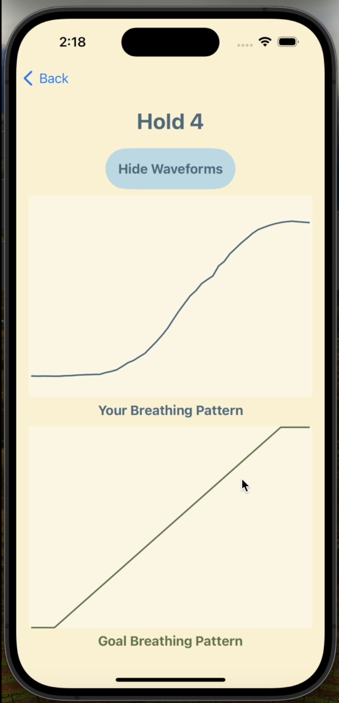
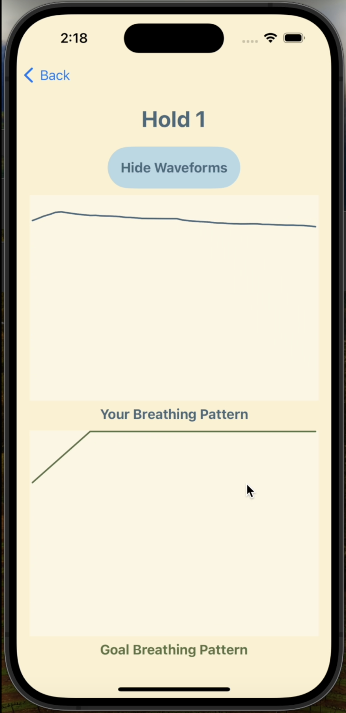
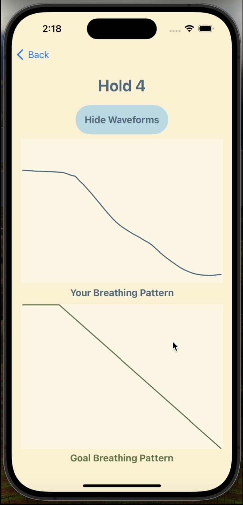
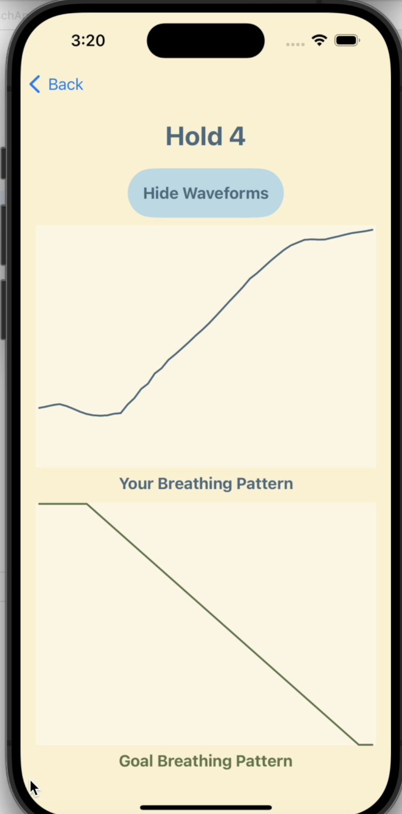
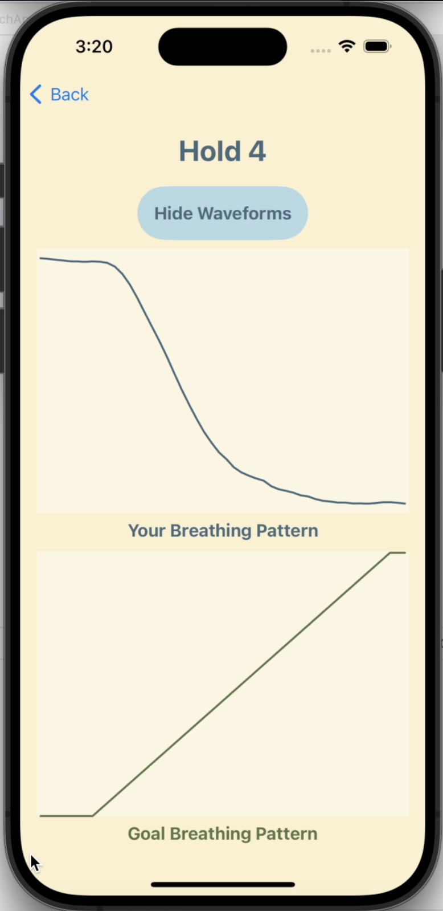
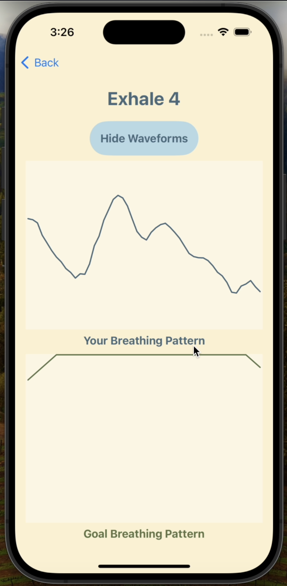
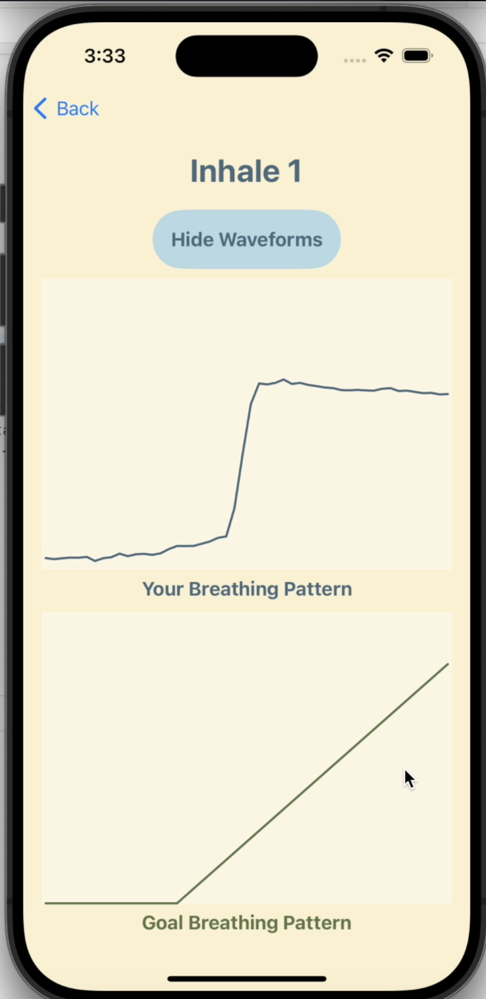

# Table of Contents
* Abstract
* [Introduction](#1-introduction)
* [Related Work](#2-related-work)
* [Technical Approach](#3-technical-approach)
* [Evaluation and Results](#4-evaluation-and-results)
* [Discussion and Conclusions](#5-discussion-and-conclusions)
* [References](#6-references)

# Abstract

This project aims to create a Breathing Coach app which guides a user through a breathing exercise and provides the user's breathing pattern and feedback in real time. Our goal is to overcome the shortcomings of current methods which monitor breathing using on body sensors and do not provide feedback to the user. Our IOT system involves a sensor not attached to the body and the implementation of both vocal and visual feedback on user's breathing style.

To gather breathing data, we use a Ultra Wide Band (UWB) sensor, which is attached to a Raspberry Pi, and located at a distance from the user. This data is then sent to an iOS app using the ZeroMQ Message Queue. We then perform data processing and analysis as needed to extract meaningful breathing signals and display the waveforms to the screen during the guided meditation. During meditation the expected waveforms are displayed next to user's waveform to provide visual feedback. Also, by analyzing user's waveform, real time vocal feedback is provided regarding and depth of breathing and more.

This project is in collaboration with the NESL Lab and Ph.D. Candidate Ziqi Wang.

# 1. Introduction

## 1. Motivation & Objective

Physiological feature sensing is important for accurate guidance during yoga and meditation. Most current independent guidance systems require users to wear on body sensors like chest belts or watches to measure physiological signals. These approaches are either uncomfortable and constrict motion or simply collect user statistics without providing feedback.

This motivated us to consider wireless technologies that can sense physiological features without touching the user and integrate these technologies into a mobile app that can further process this information and provide feedback to the user. This will also make yoga and meditation more accessible contributing to the fields of health and wellness.

Our objective is to build a iOS app that serves as proof of concept that wireless Ultra Wide Band (UWB) signals can be used for meditation guidance.

## 2. State of the Art & Its Limitations

Breathing can be measured today using several approaches that all feature sensors that are physically attached to a user's body. One such approach is band that attaches around a users' chest and measures the vibrations in and around the chest. Another approach, [RESPA](https://www.zansors.com/respa), features a small clip on device that connects to an iOS or Android app to provide breathing data. This wearable sensor provides real time haptic feedback as well. Additionally, MindfulWatch is a smartwatch-based sensing system designed for real time monitoring of respiration during meditation by capturing subtle wrist movements. The limitations of these approaches are the reliance on wearable devices, that can constrict the user's motion or be uncomfortable to wear, or no feedback.

There are also wireless techniques currently that are useful for capturing physiological signals similar to what we propose in this project. As an example, the technology 'EQ-Radio' uses Frequency Modulated Carrier Wave (FMCW) for emotion sensing by extracting heartbeats and respiration from RF signals reflected off the human body. In another case, UWB signals are used for non contact diagnosis of sleep apnea by detecting respiratory events. So, there are currently wireless technologies to sense physiological features for the purposes of smart cities, medical diagnosis, and more. However, wireless technologies have not been explored for exercising, meditation, or general wellness.

## 3. Novelty & Rationale

In this project we explore UWB as a potential solution to meditation guidance in order to overcome shortcomings of current state of the art mentioned above and equally importantly to expand the scope of wireless sensing into exercise guidance. We choose the UWB wireless technology as a UWB sensor setup is already available in NESL Lab.

Our approach uses an UWB sensor to measure breathing rate without physically touching the user. This allows users to breathe and meditate naturally without interference and distraction. Combining this benefit with real time feedback will allow users' phones to become virtual breathing coaches. 

We believed in this project as our team has experience coding mobile apps and is passionate about working on projects that provide health benefits.

## 4. Potential Impact

In the short term, this project will prove that it is possible to measure breathing rate using a UWB sensor and provide real time feedback. After thorough development and experimentation, our app will allow mediation and yoga coaching to become more accessible as users will only need a sensor and phone to receive real time breathing feedback. Moreover, this can serve as a step towards improving this or exploring other wireless technologies like FMCW for yoga and wellness.

## 5. Challenges

One challenge was the selection of the networking between the sensor (raspberry pi) and iOS app. There are several possible methods of networking: Bluetooth, Web Sockets, Message Queues. It is important to pick the optimal networking framework to assure data is sent continuously with little to no packet loss. Additionally, this data needs to be sent with minimal latency in order for the user to receive real time feedback. We ultimately chose the ZeroMQ messaging system which has all the desirable qualities mentioned and ultimately results in pretty good real time user breathing waveforms.

Another challenge will be to collect the optimal signal and perform the appropriate signal processing. This requires real time data analysis, which again is a challenging task given our strict latency constraints. Currently, the user is assumed to sit at a particular distance from the sensor and this assumption simplifies the data communication and analysis.

The users waveforms are very susceptible to distance of user from sensor and also environment. If not handled correctly it is easy to see noisy waveforms or flipped waveforms.

Given our team has a computer science background, we also needed to gain an understanding of signal processing.

## 6. Requirements for Success

To perform the project, the following skills and resources are necessary:

### Skills
* C/C++ coding skills for the Raspberry Pi
* Networking frameworks (Web Socket or Message Queue Programming)
* iOS development in Swift
* Matlab or a comparable language for data analysis
* Signal Processing fundamentals
* UI/UX design for the app

### Resources
* UWB sensor from NESL lab
* Assistance from Ziqi Wang as needed

## 7. Metrics of Success

Our metrics of success are as follows:
1. UWB sensor data is sent from the raspberry pi to iOS app and can be displayed on the app as a waveform.
2. The iOS app can take the user through a breathing exercise.
3. We can display the expected and actual breathing rate on the UI during the breathing exercise.
4. Providing simple basic real time vocal feedback to the user.

Some stretch goals are:
1. Making vocal feedback more robust. Potentially by using reinforcemnt learning algorithms
2. Provide support for multiple breathing exercises.
3. Allowing some more flexibility of distance between user and sensor and hence implementing necessary real time data analysis for waveforms.
4. Taking care of noisy data, flipped waveforms, or other environmentally susceptible sensor data issues. 
5. We can display the user's heart rate on the UI during the breathing exercise.

# 2. Related Work

### Papers

### MindfulWatch: A Smartwatch-Based System For Real-Time Respiration Monitoring During Meditation
* The research paper introduces MindfulWatch, a smartwatch-based sensing system designed for real-time monitoring of respiration during meditation. MindfulWatch utilizes motion sensors to detect subtle wrist rotations induced by respiration, enabling accurate measurement of breathing patterns without the need for training. The system offers essential biosignals, including the duration of inhalation and exhalation, which can be used as objective measures of meditation efficacy. It aims to provide real-time feedback to meditators, potentially enhancing the effectiveness of meditation practice.
### EQ-Radio: Emotion Recognition Using Wireless Signals
* The research paper introduces a technique to recognize emotion using RF signals reflected off of human body. These signals are processed to extract respiration and individual heartbeats of a user. The this information is fed into an SVM classifier that predicts emotion.
### Non-contact diagnosis of obstructive sleep apnea using impulse-radio ultra-wideband radar
* This research paper uses UWB technology to detect user respiration and help diagnose the sleep apnea medical condition.

### Datasets

Our project features real time data collected from the NESL lab's UWB sensor. We construct datasets as needed from this data.

### Software

* C/C++/Linux for Raspberry Pi
* ZeroMQ for networking between Raspberry Pi and mobile device
* Swift/Xcode for iOS development
* Matlab if needed for data processing

# 3. Technical Approach

### Overview of UWB sensing
A UWB sensor sends narrow pulses and samples to see when pulses arrive back to retrieve the reflection time and estimate distance. The user’s chest movement during breathing can be captured through changes in these timings.

### Current UWB system
Raspberry Pi is connected to a UWB sensor. C++ code on Raspberry Pi triggers the sensor to collect and send data.

### UWB sensor data
Initial sensor data analysis was done in Matlab. Sensor collects frames of data over time which affected by various environmental aspects. The current frame rate is 10 frames per second. Within all of these frames a particular index value 
(determined by distance of user chest from sensor) informs actual user breathing. We currently hardcode distance of user from sensor. Using frame index (bin) prediction we only send that particular value per frame over to iOS app.

### Data Transfer Methodology
This requires both Pi and device to be connected to same WiFi. We use the ZeroMQ messaging system because it is lightweight, easy to use, and fast. We use a publisher-subscriber model in this software. The publisher was set up in the Pi code (socket binding to a tcp port) and the subscriber was set up in the app (socket connecting to the tcp port). The subscriber listens to breathing data published by publisher. This data is then used to graphically show the user his/her breathing.

### Breathing Exercise Implemented
Currently for proof of concept, only one exercise, 'Box Breathing,' has been implemented. The steps in this exercise are inhale, hold, exhale, hold, and repeat.

### Real Time Feedback Mechanisms
* Visual: Expected breathing graph displayed below user breathing graph. Expected graph formed through a python script that generates a neat waveform conforming to the box breathing pattern.
* Vocal: We implemented logic for checking slope of user breathing graph during inhale and exhale to infer breathing depth.
We also implemented logic for checking breathing variation during hold steps. Deviations above thresholds trigger a vocal feedback to the user.

# 4. Evaluation and Results
Our initial goals have been met. We were able to create a visually appealing, reliable, and easy to use iOS app. Our app instructs users to first select a breathing exercise. The instructions of the exercise are then displayed and the exercise begins when the start button is clicked. We had initially wanted to display a creative visual to users. Our data quality is not good enough to do so well at this point due to factors such as varying distance values and additional inconsistencies.

Perfect data can be seen as follows.

Our findings uncovered a few valuable discoveries. Images are attached for reference
1. Difficulty checking error 
	* We could not simply implement fixed error thresholds due to inconsistencies in distance values measured from run to run
	* We checked slopes depending on phase but it was hard to gain much information from this data for reasons detailed in later sections of this report.
2. Flipped graphs
	* Occasionally, the entire waveform is flipped, with inhales corresponding to decreasing values and exhales corresponding to increasing values.
	* One possible solution is to detect this issue in a calibration period and invert data
	* The difficulty in solving this issue is discerning between flipped graphs and incorrect breathing by the user
	* Furthermore, we need to determine what the axis of reflection is as it changes every time
	* 
	* 
3. Distance and orientation must be perfect
	* If the user is not in the perfect position, the data we see is wildly inaccurate
	* There is no clear solution to this issue
	* Solving this will require sending large amounts of data in real time and performing analysis in real time to determine the user's actual distance 
	* 

# 5. Discussion and Conclusions

Overall, we have proven that UWB sensing can be used to detect and analyze breathing. We were able to create a user-friendly, reliable, and easy to use app. We also implemented real time feedback, both visually and vocally, which works as expected. There are some issues with the sensor, which are detailed throughout the report. Some examples of perfect breathing can be seen below.

There are several avenues for improvement, which are as follows:

Enhancements:
1. Normalize data from 0 to 1
	* This avoids the issue of dynamic ranges, which are currently implemented
	* This also can allow us to display attractive breathing visuals
2. Determine user’s distance in real time
	* We can use video as well to determine this. It could be possible to determine the user's distance using the video measurement feature of the iPhone.
3. Implement better error checking
	* We can use ML to better understand user’s breathing and provide appropriate feedback
4. We can add support for more breathing exercises

Things to test and analyze in further research:
1. Networking: web sockets vs zmq
	* If the enhancements mentioned above are implemented, we will need to send larger amounts of data over in real time. At this point, the networking might matter.
2. Try different types of smoothing
	* Non smoothed data can provide more information about the force of the inhale/exhale as shown below
	* 
	* One example of a smoothing method we can try is the Savitzky Golay filter
	* More research will need to be done on additional types of smoothing and the effects they may have.

# 6. References
* [MindfulWatch](https://dl.acm.org/doi/10.1145/3130922#:~:text=Operating%20solely%20on%20a%20smartwatch,%2Fs%20induced%20by%20respiration.)
    * T. Hao, C. Bi, G. Xing, R. Chan and L. Tu, "MindfulWatch: A smartwatch-based system for real-time respiration monitoring during meditation", Proc. ACM Interact. Mobile Wearable Ubiquitous Technol., vol. 1, no. 3, pp. 1-19, 2017.
    * We could get ideas about UI developemnt from this current physiological monitoring system app. This system also serves as an example for current state of the art and reflects shortcomings our system tries to solve.
* [EQ-Radio](http://eqradio.csail.mit.edu)
	* Zhao M., Adib F., Katabi D. Emotion Recognition Using Wireless Signals. Commun. ACM. 2018. doi: 10.1145/3236621.
	* Serves as a motivation that wireless technologies are good for sensing physiological features.
* [Non-contact diagnosis of obstructive sleep apnea using impulse-radio ultra-wideband radar](https://www.nature.com/articles/s41598-020-62061-4)
	* Kang S, Kim DK, Lee Y, Lim YH, Park HK, Cho SH, Cho SH. Non-contact diagnosis of obstructive sleep apnea using impulse-radio ultra-wideband radar. Sci Rep. 2020 Mar 24;10(1):5261. doi: 10.1038/s41598-020-62061-4. PMID: 32210266; PMCID: PMC7093464
	* Serves as a motivation that UWB wireless technology, which we use in this project, is good for sensing physiological features.

### Software
* [C++](https://cplusplus.com/)
* [ZeroMq](https://zeromq.org/)
* [Swift](https://developer.apple.com/swift/)
* [Matlab](https://www.mathworks.com/academia/tah-portal/ucla-31454052.html)
